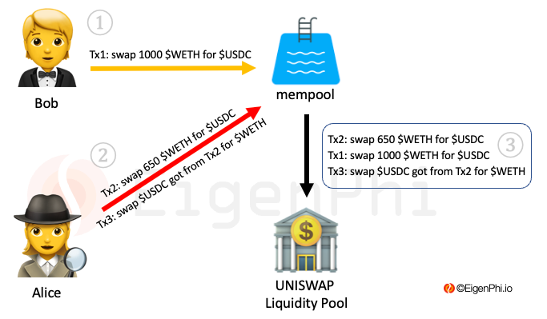

<!--
AUTHORS:
Prefer only GitHub-flavored Markdown in external text.
See README.md for details.
-->

# Solidity Cheat-sheet

Notes on Solidity & EVM taken while doing https://cryptozombies.io/en/course/
<!-- markdown="1" is required for GitHub Pages to render the TOC properly. -->

<details markdown="1" ><summary>Content</summary>

- [Solidity Cheat-sheet](#solidity-cheat-sheet)
- [State variables](#state-variables)
  - [Mapping](#mapping)
  - [Address](#address)
  - [`msg` global variable](#msg-global-variable)
  - [Time units](#time-units)
  - [Storage](#storage)
  - [Array](#array)
  - [Gas optimization](#gas-optimization)
    - [Structs Packing](#structs-packing)
- [Functions](#functions)
  - [Private functions](#private-functions)
  - [View functions](#view-functions)
  - [Pure functions](#pure-functions)
  - [Payable functions](#payable-functions)
    - [Payable functions, Gas And View functions](#payable-functions-gas-and-view-functions)
    - [Withdraw](#withdraw)
- [Typecasting](#typecasting)
- [Events](#events)
- [Require](#require)
- [Imports](#imports)
- [Storage vs Memory](#storage-vs-memory)
- [Inheritance](#inheritance)
- [Security](#security)
  - [Interacting with other Smart contracts](#interacting-with-other-smart-contracts)
  - [Immutable](#immutable)
  - [Modifiers \& Constructor](#modifiers--constructor)
  - [Backdoors](#backdoors)
  - [Custom modifiers](#custom-modifiers)
- [Gas optimization](#gas-optimization-1)
- [Standard contracts](#standard-contracts)
  - [ERC20 - Token](#erc20---token)
  - [ERC721 - NFT](#erc721---nft)
  - [ERC-1155](#erc-1155)
- [Burning](#burning)
- [Security Overflow / Underflow](#security-overflow--underflow)
  - [Comments](#comments)
- [Web3](#web3)
  - [Ethereum node](#ethereum-node)
  - [Signing transactions](#signing-transactions)
  - [Connect to a contract](#connect-to-a-contract)
  - [Call (no-popup)](#call-no-popup)
  - [send (popup)](#send-popup)
    - [send (popup + send eth/wei)](#send-popup--send-ethwei)
    - [Responses](#responses)
  - [Public state variables](#public-state-variables)
  - [Account active in metamask](#account-active-in-metamask)
  - [Events](#events-1)
  - [Indexed](#indexed)
    - [Past events](#past-events)
    - [Events as storage!](#events-as-storage)
- [On-chain vs Off-chain](#on-chain-vs-off-chain)
- [Mempool](#mempool)
- [MEV](#mev)
  - [MEV Attack](#mev-attack)
    - [How are they done?](#how-are-they-done)
  - [Arbbot](#arbbot)
- [AMM](#amm)
  - [Order book Model](#order-book-model)
  - [Automated Market Maker](#automated-market-maker)
    - [Routing](#routing)
  - [Taker and Maker](#taker-and-maker)
- [Flashbots](#flashbots)
  - [Intro](#intro)
  - [Features](#features)
  - [Benefits](#benefits)
- [RPC](#rpc)
  - [Conventions](#conventions)

</p></details>

# State variables
```solidity
(string | uint | ...) [public | private] <variable_name>
```

In Solidity, when you declare a variable public, it automatically creates a public "getter" function with the same name.

- uint8 => 2^8 = 256 possible values [0,255]
- uint16 => 2^16 = 65536 values
- uint == uint256


## Mapping

- mapping is a hash / dict

Declare
```solidity
mapping(address => uint) <variable_name>
```

Access with memory and storage
```
Sandwich storage mySandwich = <variable_name>[address1]; // POINTER
Sandwich memory anotherSandwich = <variable_name>[address2]; // COPY
```

## Address

Address of a contract or a wallet. This is a 20 bytes variable.

## `msg` global variable

msg is a global variable (data from the caller of the function)
```solidity
msg.sender // address of the caller
msg.value // amount of wei that is being trasfer to the payable function.
```

## Time units

- `now` will give current timestamp. (type uint by default). Time units is in seconds since 1970.
- Hour is 3600.`1 hours`
- Day is 86400. `1 days`

```solidity
uint cooldownTime = 1 days; // Compiler will change to seconds
uint lastUpdated = now;
uint readyTime = now + cooldownTime;
```

## Storage

- Most expensive operation (gas) is writing into storage. Only write data when it is absolutely necessary.
> In most programming languages, looping over large data sets is expensive. But in Solidity, this is way cheaper than using storage if it's in an external view function, since view functions don't cost your users any gas. (And gas costs your users real money!).

- Access storage from the smart contract. `Zombie storage myZombie = zombies[_zombieId]`

## Array

- `Memory` arrays must be static. Created with length. 3. 
- `Storage` arrays can be dynamic.

- Sometimes it is better to go through all the items of an array and from them create the results we need. Instead of having multiple mappings in the storage and with every transaction need to update several.

## Gas optimization

Normally there's no benefit in using these sub-types (uint, uint8, uint32, ...) because Solidity reserves 256 bits of storage regardless of the uint size. For example, using uint8 instead of uint (uint256) won't save you any gas.

### Structs Packing

However, when we use structs this is not the case anymore. Exists the concept of **Structs Packing** which optimizes the storage :
- Smaller units will use less storage in the blockchain.
- Putting same units together will use less storage in the blockchain.


# Functions

```solidity
function <function_name>((string|uint) [memory|callback] <variable_name>, ...) [public|private|external|internal] [view|pure] [returns (<type> <variable_name>), ...]{
    // body
}
```

## Private functions

* Functions by default are public.
* Good practice. `Always private` unless you want to expose it with public.
* Private function names start with underscore

## View functions

* If we are not changing state but we are `READING` it
* Important for Gas Optimization! View functions called externally of the smart contract doesn't use GAS! `Gas free functions`!
    * So marking a function with view tells web3.js that it only needs to query your local Ethereum node to run the function, and it doesn't actually have to create a transaction on the blockchain (which would need to be run on every single node, and cost gas).
* `Only Gas-free when called externally`. Not internally.
    * Note: If a view function is called internally from another function in the same contract that is not a view function, it will still cost gas. This is because the other function creates a transaction on Ethereum, and will still need to be verified from every node. So view functions are only free when they're called externally.

## Pure functions

* If we are not changing state NEITHER READING it.
* Calculations functions.


## Payable functions

- function that receives money
- `OnlineStore.buySomething({from: web3.eth.defaultAccount, value: web3.utils.toWei(0.001)})`
- The money will be saved in the smart contract. Unless you take it out because you are the owner.
- `address(this).balance` this is balance of the contract.
- Payable only sets the possibility of sending money not the amount. (Defined in the frontend). 

### Payable functions, Gas And View functions

- Every function that is view and is called externally is GAS-FREE
- All the rest of functions cost GAS. This will require user/address sign a transaction.
- Payable functions are functions in which you are able to send money. (This functions also costs GAS!)


### Withdraw
- Send ether to another address from the smart contract. It needs to be `address payable`
- transfer function. Buys from the seller we send the money to the seller. `seller.transfer(msg.value)`. Decentralized marketplace. 

```solidity
recipient_of_funds.transfer(amount);
```

# Typecasting

* State variables have a space in the blockchain for them
* Operations between types need to be the same so we do casting. (Every operator has a function to cast)

address == bytes20
string is a chain of bytes
```solidity
uint8 cat = 5;
uint dog = 5;
uint combinations = uint(cat) * dog;
```

# Events

Definition of an event
```solidity
event <event_name>(<type> [indexed] <variable_name>, ...)
```

Fire an event
```solidity
emit <event_mname>(<variable_name>, ...)
```

- All events that happen are saved in the blockchain transparent and are able to be queried.
- Frontend clients are able to subscribe to events that happen in the blokchain.
- Exists the `indexed`, if a variable is indexed you will be able to query events filtering by the values of that specific variable.
- Maximum of 3 indexed variables.


# Require

Require help us define conditions to need to be satisfied before continuing with the execution. Mostly used for Authorization and Security purposes.
- Only specific addresses can do this. (Admin)
- Only the owner of this NFT is allowed to change it. (Ownership)
- ...

```solidity
require(<necesary_condition_to_continue>) // if true we continue
```

> Reuse them using modifiers

# Imports

- Use relative imports
- To have long codebases of Solidity. Standard is one contract per file.

```solidity
import "./someothercontract.sol";
```

Extra: Libraries a piece of code that can be called from any contract without the need to deploy it again. https://medium.com/aragondec/library-driven-development-in-solidity-2bebcaf88736


# Storage vs Memory

- Storage (Hard disk), stored permanently on the blockchain
    -  State variables (variables declared outside of functions) are by default storage and written permanently to the blockchain.
- Memory (RAM), temporary.
    - Variables declared inside functions are memory and will disappear when the function call ends.able to update it.
- callData (RAM). Is like memory but for external functions.

Access writable storage from struct or array you need to use storage.
```solidity
Sandwich storage mySandwich = sandwiches[_index]; // POINTER
Sandwich memory anotherSandwich = sandwiches[_index + 1]; // COPY
```

# Inheritance

Same as other languages.
- private functions are not accessible
- internal, external and public functions are accessible

Inheritance vs Composition
- `Inheritance` is a much simpler model and will always be cheaper to execute.
- You can do very simple contracts.
- Composition using Libraries enables to implement more complex.


# Security

## Interacting with other Smart contracts

Best practices is to implement an ERC `interface` and then define the address of the smart contract that we want to interact.
- This will enable us to change to any Smart contract that implements this interface.
- `Allow owner of the contract to update the address!` In case this is needed in the future. (Dont hard code it).

```solidity
// Define the contract
contract KittyInterface {
  function getKitty(uint256 _id) external view returns (
    bool isGestating,
    bool isReady,
    uint256 cooldownIndex,
    uint256 nextActionAt,
    uint256 siringWithId,
    uint256 birthTime,
    uint256 matronId,
    uint256 sireId,
    uint256 generation,
    uint256 genes
  );
}

contract Main {
    
    function setKittyContractAddress(address _address) external onlyOwner {
        kittyContract = KittyInterface(_address);
    }

    // Use it
    KittyInterface kittyContract = KittyInterface(address);
    (,,,,,,,,,kittyDna) = kittyContract.getKitty(_kittyId);
}

```

`But What happens if the contract we were using has a bug?`

## Immutable

- Contract cannot be modified or change once deployed. (Not even by the owner!)
- Makes security a big concern.
- Feature: No one has power over the smart contract (Unless specified in the contract).

What happens if your smart contract uses other contracts? (bugs)
- Make their address updatable. (setter only for the owner) `setKittyContractAddress`

## Modifiers & Constructor

- `Constructor` only executed once we deploy the smart contract.
- onlyOwner: Half function. Usually used to check `Authorization`.
- `Modifier` is just like a function but with different key. 


## Backdoors

- It could be malicious onlyOnwer. 
- Backdoor that enables it superadmin features.

> So it's important to remember that just because a DApp is on Ethereum does not automatically mean it's decentralized — you have to actually read the full source code to make sure it's free of special controls by the owner that you need to potentially worry about. There's a careful balance as a developer between maintaining control over a DApp such that you can fix potential bugs, and building an owner-less platform that your users can trust to secure their data.


## Custom modifiers

Modifiers to only allow special abilities. Giving arguments.
```solidity
// Only certain zombies above a specific level.
modifier aboveLevel(uint _level, uint _zombieId) {
    require(zombies[_zombieId].level >= _level);
    _;
}
```

Only possible to do this on `YOUR` zombie. The zombie that the `transaction sender` is trying to do something with.
```solidity
modifier ownerOf(uint _zombieId) {
    require(msg.sender == zombieToOwner[_zombieId]);
    _;
}
```


# Gas optimization

- Every time you make a `TRANSACTION` you pay gas. Why? because all the nodes are executing your transaction in the blockchain locally.

How to calculate `Gas`?
- Gas cost is the sum-up of `computing resources` of the transaction.
  - The total gas cost of your function is the sum of the gas costs of all its individual operations.
- So, `Bad code` / Sloppy code will mean your users paying **premium**.


# Standard contracts

## ERC20 - Token

> Token is just a contract that keeps track of who owns how much of that token.

- Tokens: Basically ERC20 is a smart contract that implements:
    - function transferFrom(address _from, address _to, uint256 _tokenId)
    - function balanceOf(address _owner)
    - mapping(address => uint256) balances,
- Every contract that inherits ERC20 has those functions implemented.
- That means when integrating ERC20 contract into your Smart contract you can actually integrate it with every token that is ERC20.

They act like currencies.
---> New version: ERC-777 backward compatible with ERC-20.


## ERC721 - NFT

- tokens that are unique and are not divisible.
- You can only trade them in whole units.
- Marketplace that trades exchangeable collectibles ERC721 can integrate with every token that is ERC721.

```solidity
contract ERC721 {
  event Transfer(address indexed _from, address indexed _to, uint256 indexed _tokenId);
  event Approval(address indexed _owner, address indexed _approved, uint256 indexed _tokenId);

  function balanceOf(address _owner) external view returns (uint256);
  function ownerOf(uint256 _tokenId) external view returns (address);
  function transferFrom(address _from, address _to, uint256 _tokenId) external payable;
  function approve(address _approved, uint256 _tokenId) external payable;
}
```

## ERC-1155

new version

# Burning

Transfer tokens to 0. Address that nobody has the private key.

# Security Overflow / Underflow
```solidity
uint8 number = 255;
number++;
// Now number will be 0!
```

To prevent this, OpenZeppelin has created a library called SafeMath

```solidity
contract {
    using SafeMath for uint256;
    function {
        ...
        ownerZombieCount[_from] = ownerZombieCount[_from].sub(1);
        ownerZombieCount[_from] = ownerZombieCount[_from].add(1);
        ownerZombieCount[_from] = ownerZombieCount[_from].sub(1);
        ...
    }
}
```


## Comments

- Standard to use is natspec

@title and @author are straightforward.

@notice explains to a user what the contract / function does. @dev is for explaining extra details to developers.

@param and @return are for describing what each parameter and return value of a function are for.

Note that you don't always have to use all of these tags for every function — all tags are optional. But at the very least, leave a @dev note explaining what each function does

Questions:
- internal in the constructor 
- When doing a transaction, Every node in the network needs to run that function?
- Every software architectural decision is gas driven.

# Web3

https://konghq.com/blog/web3-basics-for-frontend-developers


```bash
// Using NPM
npm install web3

// Using Yarn
yarn add web3

// Using Bower
bower install web3
```
or

```html
<script language="javascript" type="text/javascript" src="web3.min.js"></script>
```

## Ethereum node

Remember, Ethereum is made up of nodes that all share a copy of the same data. Setting a Web3 Provider in Web3.js tells our code which node we should be talking to handle our reads and writes. It's kind of like setting the URL of the remote web server for your API calls in a traditional web app.

You could host your own Ethereum node as a provider. However, there's a third-party service that makes your life easier so you don't need to maintain your own Ethereum node in order to provide a DApp for your users — Infura.


## Signing transactions

We are actually the ones executing the transaction over a specific address. Sign with the private key. Metamask is a browser extension for Chrome and Firefox that lets users securely manage their Ethereum accounts and private keys, and use these accounts to interact with websites that are using Web3.js.

## Connect to a contract

To connect to a contract, I need ABI (JSON specification of the calls to the contract) and contract address. 

```js
cryptoZombies = new web3js.eth.Contract(cryptoZombiesABI, cryptoZombiesAddress);
```

## Call (no-popup)

`call` is used for view and pure functions. It only runs on the local node, and won't create a transaction on the blockchain

```js
myContract.methods.myMethod(123).call()
```

## send (popup)

This requires the use of GAS FEES and the user needs to sign the transaction!

- send will create a transaction and change data on the blockchain. You'll need to use send for any functions that aren't view or pure.

> Note: sending a transaction will require the user to pay gas, and will pop up their Metamask to prompt them to sign a transaction. When we use Metamask as our web3 provider, this all happens automatically when we call send(), and we don't need to do anything special in our code. Pretty cool!

```js
myContract.methods.myMethod(123).send()
```

### send (popup + send eth/wei)

payable functions!

We need to specify how much to send in wei, not Ether. (10^18 wei in one ether)

```js
cryptoZombies.methods.levelUp(zombieId).send({ from: userAccount, value: web3.utils.toWei("0.001", "ether") })
```

### Responses

- receipt will fire when the transaction is included into a block on Ethereum, which means our zombie has been created and saved on our contract
- error will fire if there's an issue that prevented the transaction from being included in a block, such as the user not sending enough gas. We'll want to inform the user in our UI that the transaction didn't go through so they can try again.


## Public state variables

Automatic getters to get the value. 
```js
// zombies is a mapping
cryptoZombies.methods.zombies(id).call()
```

## Account active in metamask

Get the active account from the user that is checking the website.

```js
var userAccount = web3.eth.accounts[0];
```

## Events

How do we subscribe to the events that are getting fired from the contract?

- cryptoZombies.methods
- cryptoZombies.events

```
cryptoZombies.events.NewZombie()
    .on("data", function(event) {
        let zombie = event.returnValues;
        // We can access this event's 3 return values on the `event.returnValues` object:
        console.log("A new zombie was born!", zombie.zombieId, zombie.name, zombie.dna);
    }).on("error", console.error);
```

How do we only listen to specific events? Not all
Using indexed keyword in the event definition.

## Indexed

> Up to 3 parameters can be indexed

For example only get the transfer made to me.
```solidity
event Transfer(address indexed _from, address indexed _to, uint256 _tokenId);
```
Use `filter` to only fire this code when `_to` equals `userAccount`
```js
cryptoZombies.events.Transfer({ filter: { _to: userAccount } })
    .on("data", function(event) {
    let data = event.returnValues;
    // The current user just received a zombie!
    // Do something here to update the UI to show it
    getZombiesByOwner(userAccount).then(displayZombies);
    }).on("error", console.error);
```

### Past events

We can even query past events using getPastEvents, and use the filters fromBlock and toBlock to give Solidity a time range for the event logs ("block" in this case referring to the Ethereum block number):
```js
cryptoZombies.getPastEvents("NewZombie", { fromBlock: 0, toBlock: "latest" })
.then(function(events) {
  // `events` is an array of `event` objects that we can iterate, like we did above
  // This code will get us a list of every zombie that was ever created
});
```

### Events as storage!

Cheap in terms of GAS! Historical data that can be saved.

Because you can use this method to query the event logs since the beginning of time, this presents an interesting use case: Using events as a cheaper form of storage.

**The tradeoff here is that events are not readable from inside the smart contract itself**. But it's an important use-case to keep in mind if you have some data you want to be historically recorded on the blockchain so you can read it from your app's front-end.

> Interesting ideas for DDD and Event Sourcing


# On-chain vs Off-chain

ON the blockchain OFF the blockchain

Transactions: 
- On chain: carried inside the blockchain network from start to finish. Once finished, Recorded in the blockchains public ledger. 
    - GOOD: Security, Decentralization, Transparency.
    - BAD: Slow, Transactions Fees, Power usage.
- Off chain: A third party will handle the transaction. Layer 2 solutions. Second blockchain built on top of the main to help scale speed and cost.
    - GOOD: Faster, Lower cost, Anonymity.
        - BAD: Trust to the party. 

Data
- On chain: transactions data that is inside the blockchain Blocks / Addresses / etc
- Off chain: real world data. External to the blockchain.

# Mempool

Ethereum adds a new block every 12seconds. All transactions that are being created they are broadcast to the mempool where they remain pending until miners pick them and add to the block.
The highest gas fee the more likely to be added to next block. (It's the miner decission)
Miners will try to maximize profits so they will get the most expensive gas transactions.

Amazing website that helps visualize it -> https://txstreet.com/v/eth-btc 

Note:
If the gas price is too low, the transaction may wait too long in the mempool.
Therefore, a restriction is in place that invalidates the transaction after 5 minutes from the moment of creation OR if more than 35 blocks have been created since the transaction was created.


# MEV
[MEV EigenPhi Classroom](https://eigenphi-1.gitbook.io/classroom/)
[How does solana solve MEV](https://chainstack.com/what-is-mev-and-how-does-solana-solves-its-mev-issues/#:~:text=MEV%2C%20or%20%E2%80%9Cmaximal%20extractable%20value,transaction%20ordering%20on%20the%20chain.)


Conceptualized in the following paper from Cornell Tech university. [Flash boys 2.0](https://arxiv.org/abs/1904.05234)

Maximal extractable value (MEV) refers to the maximum value that can be extracted from block production more than the standard block reward and gas fees by including, excluding, and changing the order of transactions in a block.

How to change order on transactions? Gas fee. Higher gas transactions go first.

- Problems of MEV? Being the victim of a MEV Attack.
## MEV Attack

- **Sandwich MEV** [link](https://eigenphi-1.gitbook.io/classroom/mev-types/sandwich-mev)



- **Frontrunning**: is an attack where the third party attempts to intercept a large transaction 
  - I see somebody is trying to do an arbitrage getting 5% for free. I can copy same transaction and place it with higher gas fee into the transaction pool. (This will make mine being added.)
  - I am a miner and I see somebody trying to buy something I can force my transaction to be added instead.
  - Frontrunning (also known as Priority Gas Auctions (PGAs)): Transaction A is broadcasted with a higher gas price than an already pending transaction B so that A gets mined before B.
- **Back running**.
  - Backrunning: Transaction A is broadcasted with a slightly lower gas price than already pending transaction B so that A gets mined right after B in the same block.


> Solana has a standardized gas fee, which means searchers can’t front-run or back-run any transaction. (We will talk about front-running and back-running later).

### How are they done?

- **MEV Contracts** are smart contracts that execute MEV strategies.


## Arbbot

Arbitrage bots (searchers) that are looking for opportunities in the mempool to take advantage from. Once they see an opportunity they try to Sandwich the transaction victim.
However, later another bot might see same opportunity and do same transaction but with higher gas so it is being added first.

**Who wins**? The first one which will be the one paying the higher gas.

As the ecosystem comes more competitive the possible return on an opportunity decreases.

**Who wins in reality**? Miners that will get the gas fee which will be approximated equal to the arbitrage opportunity return.

This is call **priority gas auction** PGAs

https://docs.flashbots.net/

# AMM

## Order book Model

To understand AMM we need to understand order book model.

Traditional exchanges work with the model of order book. Order book is divided on the ask and bid columns and they represent.
- ASK: How much value the people is willing to sell their asseet for.
- BID: How much value the people is willing to pay for that asset.

In every **order book** we have 2 assets `Base and quote`.
ETH-USD
- You can buy ETH and sell USD.
- You can sell ETH and buy USD.

As you can see the pair ETH-USD is the same as USD-ETH in terms of the operations you can do. However the price of the pair is represented `quote-base`. So ETH-USD is basically giving price of ETH respect to USD.

Orders you can set:
- Limit order: -> Add order to the order book.
- Market order: -> Going on the other side of the order book and buy OR sell.
- ...

This is how CEX work and some DEX such as https://oasis.app/#earn

## Automated Market Maker

They use an algorithm to determine the price. `Constant Product Automated market maker`.

This algorithm sets the price which you can sell by maintaining a ratio between 2 assets creating like this a PAIR.

```
Asset X
Asset Y

`X * Y = K`

The algorithm will assure that K is always constant.
```

If you want to give asset X and take asset Y. You will do the following. I will give X amount of tokens and the pool will calculate the Y amount of tokens that you will receive. How to calculate it?

```
(X + x_give) * (Y - y_receive) = K
y_receive = Y - K / (X + x_give)
```
We know all except **y_receive**.

If we give 5 Xs should we receive 5 Ys? No. The algorithm will try to maintain K. However as you can see the more liquidity the higher the change you would have get 5Xs-5Ys. This is a problem for Big trades since they will not get a good average price.

The liquidity pool is happy it maintains the K, however we see that now the ratio of tokens is not 50:50 anymore. Now we have more X than Y. "That means that Y is more expensive than X".

Every transacton on the AMM will try to maintain this ratio.

Also, with every transaction you do through AMM you pay a fee that will go to the **liquidity providers**. This incentives people to put liquidity on the fund but this is benefitial because the more liquidity the better is the price. More money more stable price.

### Routing

Even if the Liquidity pair is not given directly. Some AMM can concatenate different liquidity pools doing several transactions over them to give liquidity of that specific token.

## Taker and Maker

Every transaction instead of Bid and Ask is also called Taker and Maker assets. 
- Asset you take => Taker => This will become more expensive.
- Asset you give => Maker => This will become cheaper.


# Flashbots

https://docs.flashbots.net/

## Intro
Flashbots Auction provides a private transaction pool + a sealed bid blockspace auction mechanism which allows block proposers (validators; previously "miners" in PoW) to trustlessly outsource the work of finding optimal block construction.

In the regular Ethereum transaction pool, users broadcast transactions to the public peer-to-peer network and specify a gas price which indicates how much they are willing to pay for each unit of computation on the ethereum chain. Block builders receive these transactions, order them by gas price, and use a greedy algorithm to produce a block which attempts to maximise the value received through transaction fees. This mechanism is a mix between an English auction and an all-pay auction where bidding for blockspace is performed in the open, the top bidder captures the opportunity, and all participants incur a cost.


## Features
Ultimately, the design goals are the following:

- Pre-trade privacy: implies transactions only become publicly known after they have been included in a block. This excludes intermediaries such as relays & block builders.
- Failed trade privacy: implies losing bids are never included in a block, thus never exposed to the public.
- Efficiency: implies MEV extraction is performed without causing unnecessary network or chain congestion.
- Bundle merging: implies it is possible to merge multiple incoming bundles without conflict.
- Finality protection: implies it is impractical for Flashbots blocks containing Flashbots bundles to be modified once propagated to the network. This would protect against time-bandit chain re-org attacks.
- Complete privacy: implies intermediaries like relays and validators cannot observe the content of transactions until included on chain.
- Permissionless: implies there are no trusted intermediaries which can censor transactions.

Technical architecture: https://docs.flashbots.net/flashbots-auction/overview#technical-architecture


## Benefits

Flashbots Protect makes it easy for everyday users and developers to use Flashbots for frontrunning protection.

- Frontrunning protection: transactions will not be seen by hungry sandwich bots in the public mempool.
- No failed transactions: transactions will only be included if it doesn't include any reverts, so users don't pay for failed transactions. Note: transactions could be included in uncled blocks, emitted to the mempool, and then included on-chain.
- Etherscan integration: users can see the status of their transactions on Etherscan.


# RPC

JSON-RPC is a stateless, light-weight remote procedure call (RPC) protocol. It defines several data structures and the rules around their processing. It is transport agnostic in that the concepts can be used within the same process, over sockets, over HTTP, or in many various message passing environments. It uses JSON (RFC 4627) as data format.

Libraries wrap JSON-RPCC to make it easier.

## Conventions

Two key data types get passed over JSON: unformatted byte arrays and quantities. Both are passed with a hex encoding but with different requirements for formatting.

- Quantities encoded as hexadecimal. 0x0, 0x41, ...
- Unformatted data (byte arrays, account addresses, hashes, bytecode arrays): encode as hex, prefix with "0x", two hex digits per byte.
